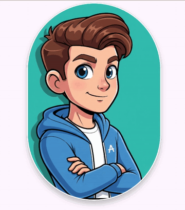

# EZCrop

A lightweight, easy-to-use image cropping component for Jetpack Compose.

The crop frame stays put while the image pans and pinch-zooms behind it. Edges stretch like a
rubber band and snap back into place, and whatever ends up inside the frame is the crop.



- Circle and rectangle frames, with a fixed or free aspect ratio
- Customizable background, border and shadow
- Reports the selection in image pixels and leaves the actual cropping to you
- Depends only on Compose UI, Foundation and Animation, not on Material

## Installation

```kotlin
dependencies {
    implementation("io.github.bugburrito:ezcrop:0.1.0")
}
```

Requires `minSdk` 24.

## Usage

```kotlin
var cropArea by remember { mutableStateOf<CropArea?>(null) }

EZCrop(
    modifier = Modifier
        .fillMaxWidth()
        .aspectRatio(1f),
    imageBitmap = imageBitmap,
    cropShape = CropShape.Rectangle(aspectRatio = 16f / 9f),
    onCropAreaChanged = { cropArea = it },
)

// Later, e.g. when the user confirms:
val cropped = cropArea?.let {
    Bitmap.createBitmap(imageBitmap.asAndroidBitmap(), it.left, it.top, it.width, it.height)
}
```

`EZCrop` never creates or modifies a bitmap. `onCropAreaChanged` reports the selected area as a
`CropArea` in pixels of the `imageBitmap` you passed in. It is invoked when an image is first
shown, when the image, shape or available size changes, and at the end of every pan or zoom
gesture.

`modifier` must give `EZCrop` a bounded size, e.g. `fillMaxWidth().aspectRatio(1f)` or
`size(300.dp)`. It has no intrinsic size.

### Crop shape

```kotlin
CropShape.Circle()                  // round avatar crop, given a square EZCrop
CropShape.Circle(aspectRatio = 1f)  // always a true circle
CropShape.Rectangle(16f / 9f)       // fixed 16:9 crop
CropShape.Rectangle()               // rectangle filling the whole EZCrop
```

With an aspect ratio, the frame is the largest one of that ratio that fits, centered. Without
one, it fills `EZCrop` completely.

The reported `CropArea` is always the rectangular bounding box of the frame, also for
`CropShape.Circle`. Use `cropShape.toComposeShape()` to clip your own preview of the result to
the same outline.

### Appearance

```kotlin
EZCrop(
    imageBitmap = imageBitmap,
    background = SolidColor(Color.DarkGray),
    border = CropBorder(width = 1.dp, color = Color.Yellow),
    shadow = CropShadow(elevation = 12.dp),
)
```

Pass `CropBorder(width = 0.dp)` or `CropShadow(elevation = 0.dp)` to turn either one off. The
shadow is drawn outside the frame, so leave some padding around `EZCrop` for it to show.

### Large images

The bitmap is redrawn on every frame of a gesture and stays in memory for as long as `EZCrop`
is shown, so pass a downscaled preview rather than the original photo. Decode the image at
roughly the on-screen size of `EZCrop` (e.g. with `ImageDecoder.setTargetSampleSize` or
`BitmapFactory.Options.inSampleSize`), then multiply the reported `CropArea` by the sample size
and crop the original once the user confirms.

### State

Pan and zoom live inside `EZCrop`. They survive recomposition, but not Activity recreation. When
the image, shape or size changes, the current pan and zoom are kept and only adjusted as far as
needed to keep the frame filled. To start over with the initial framing for a new image, wrap
the call in `key(imageBitmap) { ... }`.

## Limitations

- Rotation is not supported yet.
- Zoom is limited to five times the initial scale.

## Demo

The `app` module is a demo with gallery and camera pickers, shape and aspect ratio controls, and
a result screen showing the crop applied to the original image.

## License

```
Copyright 2026 bugburrito

Licensed under the Apache License, Version 2.0 (the "License");
you may not use this file except in compliance with the License.
You may obtain a copy of the License at

    http://www.apache.org/licenses/LICENSE-2.0

Unless required by applicable law or agreed to in writing, software
distributed under the License is distributed on an "AS IS" BASIS,
WITHOUT WARRANTIES OR CONDITIONS OF ANY KIND, either express or implied.
See the License for the specific language governing permissions and
limitations under the License.
```
